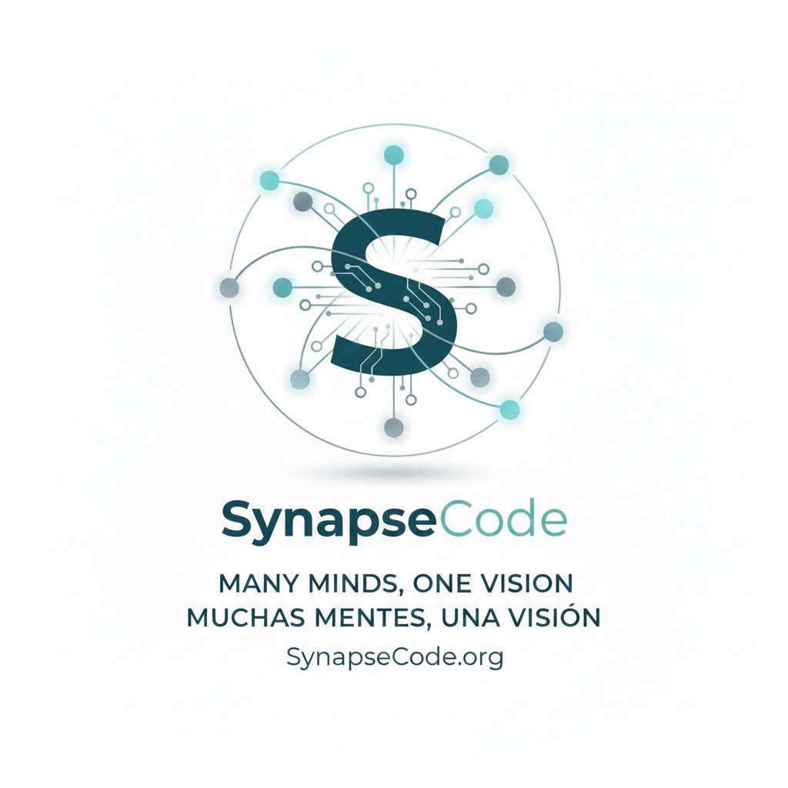

<div align="center">
  
  
  **[🇪🇸 Español](#español) · [🇬🇧 English](#english)**
  
  [](...)
  []()
  []()
  []()
  []()
</div>

---

# <a name="español"></a>🇪🇸 Español

<div align="center">
  
  
  **[🇪🇸 Español](#español) · [🇬🇧 English](#english)**
  
  [](...)
  []()
  []()
  []()
  []()
</div>

---

# <a name="español"></a>🇪🇸 Español

# 🧠 SynapseCode v3.0

Plataforma de **razonamiento colectivo híbrido** que orquesta múltiples modelos de IA en debates estructurados por roles, con veredicto del **Tribunal de Magistrados**.

Arquitectura **Master-Worker**: PC Master orquesta, PC Worker (<WORKER_IP>) ejecuta modelos locales.
**Diseño Editorial**: Background `#F5F3EE` (cream paper), Accent `#23403B` (petroleum green), Typography `Instrument Serif` + `Inter`.

---

---

## 🎯 Características Principales

### Control Center v3.0
- **Dashboard Compacto**: 4 paneles en una vista — Worker & Servicios, Diagnóstico, Métricas, Logs
- **Pestaña Debates**: Lanzar debates + historial reciente (10 últimos) con tarjetas expandibles
- **Ventana Completa de Debates**: `/admin/all-debates` — búsqueda, filtros, orden, paginación (20/página)
- **Exportación Multi-formato**: JSON, DOCX, PDF, TXT por debate individual
- **Info Proyecto**: Pestaña con README e HISTORY renderizados como markdown
- **Zero Dependencies**: Vanilla JS puro, sin build, sin node_modules
- **Estado en Tiempo Real**: WebSocket + polling (3s debates activos, 5s lista)
- **Conexión Master ↔ Worker**: Detección automática de IP, heartbeat monitoring
- **Monitor de Servicios**: Ollama, LM Studio, Jan con auto-lanzamiento
- **Diseño Editorial**: Light theme con petroleum green accent, Instrument Serif + Inter
- **Responsive**: Landing y Admin adaptados a móvil/tablet (breakpoints 768px, 480px)

### Búsqueda Web en Tiempo Real
- **DuckDuckGo Search** (`ddgs`): Resultados reales sin API key
- **Trafilatura**: Extracción de contenido completo de artículos
- **Contexto web para debates**: Información actualizada inyectada en prompts
- **Verificación factual del tribunal**: Datos reales para validar argumentos

### Reportes Profesionales
- **HTML interactivo**: Chart.js, tema oscuro, responsive
- **PDF imprimible**: Gráficos SVG inline, tema claro
- **DOCX exportable**: Documento Word con portada, tablas y veredicto
- **Generación automática**: Post-debate, con métricas y veredicto
- **Enfoque híbrido**: Datos programáticos exactos + narrativa LLM

### Asignación Inteligente de Modelos (v2.8)
- **Model Registry**: Registro central de 25+ modelos con metadata completa (contexto, velocidad, costo, especialidad)
- **Model Evaluator**: Consulta rankings web en vivo (LMSYS Arena, OpenRouter stats) con cache de 6h
- **Role Matcher**: Asignación automática del mejor modelo por rol según especialidad, plataforma y VRAM disponible
- **Smart Rotation Mode**: Crea debates con `mode: "smart_rotation"` para asignación automática óptima
- **Tablas dinámicas**: Consulta mejores modelos por categoría (finance, coding, analysis, reasoning, creative, multilingual, long_context, fast, free)

### Motor de Debate
- **Debates Secuenciales**: Multi-modelo con roles (Analista, Crítico, Sintetizador, Validador)
- **Debates Iterativos**: Cruzamientos críticos entre agentes, validación, búsqueda de consenso
- **Ultra Crossing**: Debate avanzado con 12+ agentes y múltiples fases
- **Consenso Forzado**: Protocolo de consenso con umbral configurable
- **Continuación/Pausa**: `POST /debates/{id}/continue`, `/pause`, `/resume`
- **Reducción al Absurdo**: Eliminación de sesgos de complacencia
- **Taxonomía de Intervenciones**: Clasificación de actos discursivos

| Controlador | Agentes | Fases | Cruzamiento | Gestión Contexto |
|---|---|---|---|---|
| **Sequential** | 4-6 | Lineal | Limitado | Completo |
| **Ultra (v3.0)** | 12+ | Múltiples con sincro | Master+Worker | Context Sliding Window |

### Tribunal de Magistrados
- **3 Roles Especializados**: Defensor, Fiscal, Árbitro
- **Fallback Chains**: Si un modelo falla, usa el siguiente automáticamente
- **Protocolo de Consenso**: Forzado o libre con umbral configurable

### Sistema de Reputación EMA
- **TSA** (Coherencia): Consistencia lógica del argumento
- **IID** (Info Density): Densidad informativa
- **PVT** (Veracidad): Precisión factual
- **Score Global**: Media ponderada EMA

### Caché Semántica
- Embeddings por similitud de texto
- TTL configurable, umbral de similitud ajustable
- Invalidación y limpieza por modelo/engine

### Data Warehouse
- Agregaciones automáticas: métricas diarias, trending de topics, rendimiento de modelos
- Queryable vía `GET /api/v1/system/analytics`

### Observabilidad
- **Prometheus Metrics**: `/metrics` endpoint
- **Logging Rotatorio**: 4 archivos (general, errores, engine, API), rotación 10MB/5 backups
- **Health Checks**: `/health`, `/health/live`, `/health/ready`, `/health/dependencies`

### Memoria Híbrida v2
- SQLite local + Supabase Cloud sync
- Cola persistente con reintentos y backoff exponencial

### Auto-Recuperación
- **WorkerServiceManager**: Detecta y lanza servicios caídos (WinRM, RDP, PsExec)

### 12 Adaptadores de IA
| Motor | Tipo | Modelos |
|---|---|---|
| **Ollama** | Local (Worker) | llama3, mistral, qwen2.5, deepseek-r1, etc. |
| **LM Studio** | Local (Worker) | gemma, deepseek-coder, qwen3.5 |
| **Jan** | Local (Worker) | Cualquier modelo compatible OpenAI |
| **Groq** | Cloud (Free) | llama-3.1-8b, llama-3.3-70b |
| **Gemini** | Cloud (Free) | gemini-2.5-flash, gemini-2.0-flash |
| **OpenRouter** | Cloud | 200+ modelos |
| **DeepSeek** | Cloud | deepseek-chat, deepseek-reasoner |
| **HuggingFace** | Cloud | Models vía Inference API |
| **Web Agent** | Playwright | 10 sitios de IA con stealth |

### Exportación
- JSON estructurado, Markdown, PDF (HTML imprimible), DOCX (Word), TXT (texto plano)

---

## 🚀 Inicio Rápido

### Backend
```bash
cd <ruta-a-SynapseCode>

# 1. Crear entorno virtual (primera vez)
python -m venv venv

# 2. Instalar dependencias
.\venv\Scripts\pip install -r backend\requirements.txt

# 3. Configurar .env (copiar .env.example y editar)
copy .env.example .env

# 4. Iniciar backend
start_backend.bat
# o manualmente:
set PYTHONPATH=.
.\venv\Scripts\python.exe -m uvicorn backend.main:app --host 0.0.0.0 --port 8000
```

### Admin Panel
```bash
# El backend sirve el panel en /admin automáticamente
# Abrir http://localhost:8000/admin
# Ventana completa de debates: http://localhost:8000/admin/all-debates
# Documentos del proyecto: http://localhost:8000/api/v1/docs/readme
#                         http://localhost:8000/api/v1/docs/history
```

### React SPA (Development)
```bash
cd frontend
npm run dev
# Abrir http://localhost:5173
```

### Verificar
```bash
curl http://localhost:8000/health
curl http://localhost:8000/api/v1/debates/list
```

---

## 📁 Estructura del Proyecto

```
SynapseCode/
├── backend/
│   ├── main.py                     # FastAPI app + lifespan
│   ├── config.py                   # Pydantic Settings + env vars
│   ├── logging_config.py           # Logging rotatorio
│   ├── pre_startup_check.py        # Verificación pre-lanzamiento
│   ├── requirements.txt            # Dependencias Python
│   │
│   ├── adapters/                   # 12 conectores de IA
│   │   ├── base.py                 # Base OpenAI-compatible
│   │   ├── ollama.py               # Ollama (local Worker)
│   │   ├── lm_studio.py            # LM Studio (local Worker)
│   │   ├── jan.py                  # Jan.ai (local Worker, /v1)
│   │   ├── groq.py                 # Groq Cloud
│   │   ├── gemini.py               # Google Gemini
│   │   ├── openrouter.py           # OpenRouter (200+ modelos)
│   │   ├── deepseek.py             # DeepSeek
│   │   ├── huggingface.py          # HuggingFace Inference API
│   │   ├── web_agent.py            # Playwright (10 sitios IA)
│   │   ├── http_client_manager.py  # HTTP connection pooling
│   │   └── circuit_breaker.py      # Circuit breaker pattern
│   │
│   ├── engine/                     # Motor de debate
│   │   ├── sequential_debate_controller.py  # Debate secuencial
│   │   ├── ultra_debate_controller.py       # Ultra crossing (12+ agentes)
│   │   ├── consensus_debate_controller.py   # Protocolo de consenso
│   │   ├── base_debate_controller.py        # Base controller
│   │   ├── round_controller.py              # Control de rondas
│   │   ├── session_manager.py               # Gestión de sesiones
│   │   ├── agent_orchestrator.py            # Orquestador de agentes
│   │   ├── tribunal.py                      # Tribunal de Magistrados
│   │   ├── tribunal_config.py               # Configuración del Tribunal
│   │   ├── convergence.py                   # Evaluador de convergencia
│   │   ├── quality_monitor.py               # Filtro de calidad
│   │   ├── reputation_unified.py            # Reputación EMA
│   │   ├── reductio_absurdum.py             # Reducción al absurdo
│   │   ├── intervention_taxonomy.py         # Taxonomía de intervenciones
│   │   ├── debate_models.py                 # Modelos de datos
│   │   ├── worker_launcher.py               # Auto-lanzamiento de servicios
│   │   ├── task_manager.py                  # Background tasks con retry
│   │   ├── local_engine_manager.py          # Gestión de engines locales
│   │   ├── model_registry.py                # Registro de modelos + metadata
│   │   ├── model_evaluator.py               # Evaluador con rankings web
│   │   ├── role_matcher.py                  # Asignación inteligente rol→modelo
│   │   ├── report_generator.py              # Generador de reportes HTML/PDF
│   │   ├── web_search_service.py            # Búsqueda web DuckDuckGo + Trafilatura
│   │   └── prompts.py                       # Templates por rol
│   │
│   ├── api/routes/                 # Endpoints REST
│   │   ├── debate.py               # Debates (CRUD, export, continue, pause)
│   │   ├── debate_report_generator.py  # Generador de informes híbridos
│   │   ├── system.py               # Chat directo, worker, RDP, analytics
│   │   ├── health.py               # Health checks multi-servicio
│   │   ├── cache.py                # Gestión de caché semántica
│   │   ├── sessions.py             # Gestión de sesiones
│   │   ├── runs.py                 # Historial de ejecuciones
│   │   ├── network.py              # Discovery P2P, nodos
│   │   ├── websockets.py           # WebSocket streaming
│   │   └── debug.py                # Diagnóstico
│   │
│   ├── api/
│   │   ├── websocket.py            # WebSocket handler
│   │   ├── middleware.py           # Rate limiting middleware
│   │   └── health_tracker.py       # Health tracking
│   │
│   ├── database/
│   │   ├── local_db.py             # SQLite async engine
│   │   ├── models.py               # SQLAlchemy models (7 tablas)
│   │   ├── warehouse.py            # Data Warehouse aggregations
│   │   ├── supabase_client.py      # Supabase client
│   │   └── migrations/             # SQLite migrations
│   │       └── sqlite_migrations.py
│   │
│   ├── caching/
│   │   └── semantic_cache.py       # Caché semántica con embeddings
│   │
│   ├── memory/
│   │   └── hybrid_memory_v2.py     # Memoria híbrida local+cloud
│   │
│   ├── monitoring/
│   │   └── prometheus.py           # Métricas Prometheus
│   │
│   ├── network/
│   │   ├── discovery.py            # Discovery P2P de nodos
│   │   ├── heartbeat.py            # Heartbeat Master-Worker
│   │   └── tcp_handshake.py        # Handshake TCP
│   │
│   ├── services/
│   │   ├── supabase_sync.py        # Sync a Supabase Cloud
│   │   ├── rdp_manager.py          # Gestión RDP al Worker
│   │   ├── sqlite_backup.py        # Backups locales SQLite
│   │   └── gpu_metrics.py          # Métricas GPU (NRML)
│   │
│   └── tests/
│       ├── conftest.py               # Pytest fixtures
│       ├── comprehensive_battery.py  # Test battery
│       ├── comprehensive_battery_v2.py
│       ├── api/                      # API endpoint tests
│       │   ├── test_backup_api.py
│       │   ├── test_cache_api.py
│       │   ├── test_debate_api.py
│       │   └── test_health_system.py
│       ├── integration/              # Integration tests
│       │   ├── test_controller.py
│       │   ├── test_db_models.py
│       │   ├── test_hybrid_memory.py
│       │   ├── test_migrations.py
│       │   ├── test_prometheus.py
│       │   ├── test_reputation.py
│       │   ├── test_sqlite_backup.py
│       │   ├── test_supabase_sync.py
│       │   ├── test_task_manager.py
│       │   ├── test_tribunal_fallback.py
│       │   └── test_warehouse.py
│       └── unit/                     # Unit tests
│           ├── test_adapters.py
│           ├── test_circuit_breaker.py
│           ├── test_config.py
│           ├── test_convergence.py
│           ├── test_debate_models.py
│           ├── test_gpu_metrics.py
│           ├── test_imports.py
│           ├── test_intervention_taxonomy.py
│           ├── test_local_engine_manager.py
│           ├── test_logging_config.py
│           ├── test_quality_monitor.py
│           ├── test_reductio.py
│           ├── test_semantic_cache.py
│           ├── test_tribunal_config.py
│           └── test_websocket_manager.py
│
├── frontend/
│   ├── web/                      # Landing page pública (synapsecode.org)
│   │   ├── index.html            # Página principal
│   │   ├── robots.txt
│   │   ├── sitemap.xml
│   │   └── CNAME
│   ├── control-center/           # Control Center v2.7 (Vanilla JS)
│   │   └── index.html            # App completa, zero dependencies
│   ├── admin.html                # Admin Panel v3.0 (compact dashboard)
│   ├── all-debates.html          # Full debates view with search/filter/export
│   ├── index.html                # React SPA entry point
│   └── src/                      # React frontend
│       ├── main.jsx
│       ├── pages/                # Dashboard, Debates, History, Settings, etc.
│       ├── components/           # UI components
│       ├── hooks/                # useWebSocket, useSession
│       ├── store/                # Zustand store
│       └── lib/                  # Supabase client
│
├── .env.example                    # Template de configuración
├── start_backend.bat               # Lanzar backend (uvicorn)
├── run_backend.bat                 # Lanzar backend con venv
├── start_master.bat                # Lanzar todo (backend + frontend)
├── start_synapse.bat               # Lanzar Synapse completo
├── open_control_center.bat         # Abrir Control Center
├── check_health.bat                # Verificar estado del sistema
├── install_models.bat              # Instalar modelos Ollama
├── configure_master.bat            # Configurar nodo Master
├── scripts/                        # Scripts adicionales
│   ├── worker_autostart.bat
│   ├── web_agent_sessions.bat
│   └── start_worker_template.bat
└── README.md
```

---

## 🔌 API Endpoints

### Debates
| Method | Path | Descripción |
|---|---|---|
| `POST` | `/api/v1/debates/create` | Crear debate secuencial |
| `POST` | `/api/v1/debates/create/iterative` | Crear debate iterativo |
| `POST` | `/api/v1/debates/consensus/create` | Crear debate de consenso |
| `GET` | `/api/v1/debates/list` | Lista debates activos |
| `GET` | `/api/v1/debates/{id}` | Estado completo de un debate |
| `GET` | `/api/v1/debates/{id}/status` | Estado resumido |
| `GET` | `/api/v1/debates/{id}/transcript` | Transcripción completa |
| `GET` | `/api/v1/debates/{id}/report` | Informe estructurado JSON |
| `POST` | `/api/v1/debates/{id}/generate-report` | Generar reporte híbrido Markdown |
| `POST` | `/api/v1/debates/{id}/generate-report/docx` | Generar reporte Word (.docx) |
| `POST` | `/api/v1/debates/{id}/generate-report/pdf` | Generar reporte PDF |
| `POST` | `/api/v1/debates/{id}/continue` | Continuar debate completado |
| `POST` | `/api/v1/debates/{id}/pause` | Pausar debate en ejecución |
| `POST` | `/api/v1/debates/{id}/resume` | Reanudar debate pausado |
| `DELETE` | `/api/v1/debates/{id}` | Eliminar debate |
| `GET` | `/api/v1/debates/{id}/export/json` | Exportar JSON |
| `GET` | `/api/v1/debates/{id}/export/markdown` | Exportar Markdown |
| `GET` | `/api/v1/debates/{id}/export/pdf` | Exportar PDF |
| `GET` | `/api/v1/debates/{id}/export/docx` | Exportar Word (.docx) |
| `GET` | `/api/v1/debates/{id}/export/txt` | Exportar texto plano (.txt) |
| `GET` | `/api/v1/debates/history/list` | Historial de debates |
| `GET` | `/api/v1/debates/history/{id}` | Debate histórico |
| `GET` | `/api/v1/debates/reputation` | Reputaciones de modelos |
| `GET` | `/api/v1/debates/reputation/{model}/{role}` | Reputación específica |

### Model Registry
| Method | Path | Descripción |
|---|---|---|
| `GET` | `/api/v1/debates/models/registry` | Todos los modelos registrados |
| `GET` | `/api/v1/debates/models/best-by-category` | Mejores modelos por categoría |
| `GET` | `/api/v1/debates/models/comparison-table` | Tabla comparativa completa |
| `GET` | `/api/v1/debates/models/role-matching` | Asignación modelo→rol |
| `POST` | `/api/v1/debates/models/update-rankings` | Actualizar rankings desde web |
| `GET` | `/api/v1/debates/models/smart-config` | Generar config inteligente de debate |

### Cloud (Supabase)
| Method | Path | Descripción |
|---|---|---|
| `GET` | `/api/v1/debates/cloud/status` | Estado de conexión Supabase |
| `GET` | `/api/v1/debates/cloud/list` | Lista debates en cloud |
| `GET` | `/api/v1/debates/cloud/{id}` | Debate desde cloud |
| `POST` | `/api/v1/debates/cloud/sync/{id}` | Sync debate a cloud |

### System
| Method | Path | Descripción |
|---|---|---|
| `GET` | `/api/v1/system/settings` | Configuración actual |
| `POST` | `/api/v1/system/settings` | Actualizar configuración |
| `POST` | `/api/v1/system/chat/direct` | Chat directo a modelo |
| `GET` | `/api/v1/system/metrics` | Métricas del sistema |
| `GET` | `/api/v1/system/analytics` | Analytics del Data Warehouse |
| `GET` | `/api/v1/system/health/sync` | Estado de sync Supabase |
| `GET` | `/api/v1/system/tribunal/config` | Configuración del Tribunal |
| `GET` | `/api/v1/system/health` | Health check del sistema |
| `POST` | `/api/v1/system/wake-worker` | Wake-on-LAN / RDP al Worker |
| `POST` | `/api/v1/system/wake-worker-auto` | Wake automático |
| `GET` | `/api/v1/system/rdp-status` | Estado RDP |
| `GET` | `/api/v1/system/worker/services` | Estado servicios Worker |
| `POST` | `/api/v1/system/worker/services/launch` | Lanzar servicio Worker |
| `GET` | `/api/v1/docs/{doc_name}` | Documentos del proyecto (readme, history) |

### Cache
| Method | Path | Descripción |
|---|---|---|
| `GET` | `/api/v1/cache/stats` | Estadísticas de caché |
| `POST` | `/api/v1/cache/invalidate` | Invalidar caché |
| `POST` | `/api/v1/cache/cleanup` | Limpiar expirados |
| `GET` | `/api/v1/cache/health` | Health de caché |

### Health
| Method | Path | Descripción |
|---|---|---|
| `GET` | `/health` | Health check completo |
| `GET` | `/health/live` | Liveness check |
| `GET` | `/health/ready` | Readiness check |
| `GET` | `/health/dependencies` | Estado de dependencias |

### WebSocket
| Path | Descripción |
|---|---|
| `/ws/sessions/{id}` | Streaming en tiempo real de debate |

### Network
| Method | Path | Descripción |
|---|---|---|
| `GET` | `/api/v1/network/nodes` | Nodos descubiertos |
| `GET` | `/api/v1/network/status` | Estado de red P2P |

---

## ⚙️ Configuración (.env)

### Servidor
| Variable | Default | Descripción |
|---|---|---|
| `NODE_ROLE` | `MASTER` | Rol del nodo (MASTER/WORKER) |
| `HOST` | `0.0.0.0` | IP de escucha |
| `PORT` | `8000` | Puerto del servidor |

### Worker
| Variable | Default | Descripción |
|---|---|---|
| `WORKER_OLLAMA_PORT` | `11434` | Puerto Ollama en Worker |
| `WORKER_LM_STUDIO_PORT` | `1234` | Puerto LM Studio en Worker |
| `WORKER_JAN_PORT` | `1337` | Puerto Jan en Worker |

### APIs Cloud
| Variable | Descripción |
|---|---|
| `OPENROUTER_API_KEY` | API key de OpenRouter |
| `GEMINI_API_KEY` | API key de Google Gemini |
| `GROQ_API_KEY` | API key de Groq |
| `DEEPSEEK_API_KEY` | API key de DeepSeek |
| `HF_TOKEN` | Token de HuggingFace |

### Supabase
| Variable | Descripción |
|---|---|
| `SUPABASE_URL` | URL del proyecto Supabase |
| `SUPABASE_ANON_KEY` | Clave pública anon |

### Features
| Variable | Default | Descripción |
|---|---|---|
| `WEB_AGENT_ENABLED` | `true` | Habilitar Web Agent |
| `MAX_CONCURRENT_SESSIONS` | `3` | Máximo debates simultáneos |
| `INTERVENTION_TAXONOMY_ENABLED` | `true` | Taxonomía de intervenciones |
| `QUALITY_MONITOR_ENABLED` | `true` | Monitor de calidad |
| `AGENT_REPUTATION_ENABLED` | `true` | Sistema de reputación |
| `HYBRID_MEMORY_V2_ENABLED` | `true` | Memoria híbrida |

### Logging
| Variable | Default | Descripción |
|---|---|---|
| `LOG_LEVEL` | `INFO` | Nivel de logging |
| `LOG_DIR` | `logs` | Directorio de logs |
| `LOG_MAX_BYTES` | `10485760` | Tamaño máximo por archivo (10MB) |
| `LOG_BACKUP_COUNT` | `5` | Número de backups |
| `LOG_TO_FILE` | `true` | Escribir logs a archivo |

### Timeouts
| Variable | Descripción |
|---|---|
| `MODEL_TIMEOUTS` | JSON con patrones de modelo → timeout en segundos |

---

## 🧪 Tests

```bash
cd <ruta-a-SynapseCode>
.\venv\Scripts\python -m pytest backend/tests/ -v
```

**177 tests** passing. CI/CD mandatory on every PR. Linting with Ruff (`ruff check backend/`).

---

## 📄 Licencia

MIT

---

*SynapseCode v3.0 · OscarFeMa · Mayo 2026 · [synapsecode.org](https://synapsecode.org)*

---

# <a name="english"></a>🇬🇧 English

# 🧠 SynapseCode v3.0

A **hybrid collective reasoning** platform that orchestrates multiple AI models
in role-structured debates, with a **Tribunal of Magistrates** verdict.

**Master-Worker architecture**: Master PC orchestrates, Worker PC (<WORKER_IP>)
runs local models. Accessible at [synapsecode.org](https://synapsecode.org).

## 🎯 Main Features

### Control Center v3.0
- **Compact Dashboard**: 4 panels in one view — Worker & Services, Diagnostics, Metrics, Logs
- **Debates tab**: Launch debates + recent history (last 10) with expandable cards
- **Full Debates view**: `/admin/all-debates` — search, filters, sort, pagination (20/page)
- **Multi-format export**: JSON, DOCX, PDF, TXT per individual debate
- **Project info**: Tab with README and HISTORY rendered as Markdown
- **Zero Dependencies**: Pure Vanilla JS, no build, no node_modules
- **Real-time status**: WebSocket + polling (3s active debates, 5s list)
- **Master ↔ Worker connection**: Automatic IP detection, heartbeat monitoring
- **Service monitor**: Ollama, LM Studio, Jan with auto-launch
- **Editorial design**: Light theme with petroleum green accent, Instrument Serif + Inter
- **Responsive**: Landing and Admin adapted for mobile/tablet (768px, 480px breakpoints)

### Real-Time Web Search
- **DuckDuckGo Search** (`ddgs`): Real results without API key
- **Trafilatura**: Full article content extraction
- **Web context for debates**: Updated information injected into prompts
- **Tribunal fact-checking**: Real data to validate arguments

### Professional Reports
- **Interactive HTML**: Chart.js, dark theme, responsive
- **Printable PDF**: Inline SVG charts, light theme
- **Exportable DOCX**: Word document with cover page, tables, and verdict
- **Automatic generation**: Post-debate, with metrics and verdict
- **Hybrid approach**: Exact programmatic data + LLM narrative

### Intelligent Model Assignment (v2.8)
- **Model Registry**: Central registry of 25+ models with full metadata
- **Model Evaluator**: Queries live web rankings (LMSYS Arena, OpenRouter stats) with 6h cache
- **Role Matcher**: Automatic best-model-per-role assignment
- **Smart Rotation Mode**: Create debates with `mode: "smart_rotation"` for optimal auto-assignment

### Debate Engine
- **Sequential Debates**: Multi-model with roles (Analyst, Critic, Synthesizer, Validator)
- **Iterative Debates**: Cross-arguments between agents, validation, consensus search
- **Ultra Crossing**: Advanced debate with 12+ agents and multiple phases
- **Forced Consensus**: Consensus protocol with configurable threshold
- **Continue/Pause**: `POST /debates/{id}/continue`, `/pause`, `/resume`
- **Reductio ad Absurdum**: Bias elimination protocol
- **Intervention Taxonomy**: Classification of discourse acts

| Controller | Agents | Phases | Crossing | Context Mgmt |
|---|---|---|---|---|
| **Sequential** | 4-6 | Linear | Limited | Full |
| **Ultra (v3.0)** | 12+ | Multi-sync | Master+Worker | Context Sliding Window |

### Tribunal of Magistrates
- **3 Specialized Roles**: Defender, Prosecutor, Arbitrator
- **Fallback Chains**: If a model fails, uses the next automatically
- **Consensus Protocol**: Forced or free with configurable threshold

## 🚀 Quick Start

### Backend
\`\`\`bash
cd <path-to-SynapseCode>

# 1. Create virtual environment (first time)
python -m venv venv

# 2. Install dependencies
.\venv\Scripts\pip install -r backend\requirements.txt    # Windows
# or:
./venv/bin/pip install -r backend/requirements.txt        # Linux/Mac

# 3. Configure environment variables
copy .env.example .env       # Windows
# cp .env.example .env       # Linux/Mac
# Edit .env: add API keys for Groq/Gemini/OpenRouter if needed

# 4. Start backend
start_backend.bat            # Windows
# or manually:
set PYTHONPATH=.
uvicorn backend.main:app --host 0.0.0.0 --port 8000 --workers 1
\`\`\`

### Admin Panel
\`\`\`
# Backend serves the panel at /admin automatically
# Open: http://localhost:8000/admin
# All debates view: http://localhost:8000/admin/all-debates
# Project docs: http://localhost:8000/api/v1/docs/readme
\`\`\`

### Verify
\`\`\`bash
curl http://localhost:8000/health
curl http://localhost:8000/api/v1/debates/list
\`\`\`

## ⚙️ Configuration (.env)

### Server
| Variable | Default | Description |
|---|---|---|
| `NODE_ROLE` | `MASTER` | Node role (MASTER/WORKER) |
| `HOST` | `0.0.0.0` | Listen IP |
| `PORT` | `8000` | Server port |

### Worker
| Variable | Default | Description |
|---|---|---|
| `WORKER_OLLAMA_PORT` | `11434` | Ollama port on Worker |
| `WORKER_LM_STUDIO_PORT` | `1234` | LM Studio port on Worker |
| `WORKER_JAN_PORT` | `1337` | Jan port on Worker |

### Cloud APIs
| Variable | Description |
|---|---|
| `OPENROUTER_API_KEY` | API key for OpenRouter |
| `GEMINI_API_KEY` | API key for Google Gemini |
| `GROQ_API_KEY` | API key for Groq |
| `DEEPSEEK_API_KEY` | API key for DeepSeek |
| `HF_TOKEN` | Token for HuggingFace |

### Supabase
| Variable | Description |
|---|---|
| `SUPABASE_URL` | Supabase project URL |
| `SUPABASE_ANON_KEY` | Public anon key |

### Features
| Variable | Default | Description |
|---|---|---|
| `WEB_AGENT_ENABLED` | `true` | Enable Web Agent |
| `MAX_CONCURRENT_SESSIONS` | `3` | Maximum concurrent sessions |
| `INTERVENTION_TAXONOMY_ENABLED` | `true` | Intervention taxonomy |
| `QUALITY_MONITOR_ENABLED` | `true` | Quality monitor |
| `AGENT_REPUTATION_ENABLED` | `true` | Agent reputation system |
| `HYBRID_MEMORY_V2_ENABLED` | `true` | Hybrid memory v2 |

### Logging
| Variable | Default | Description |
|---|---|---|
| `LOG_LEVEL` | `INFO` | Logging level |
| `LOG_DIR` | `logs` | Logs directory |
| `LOG_MAX_BYTES` | `10485760` | Max size per file (10MB) |
| `LOG_BACKUP_COUNT` | `5` | Number of backups |
| `LOG_TO_FILE` | `true` | Write logs to file |

### Timeouts
| Variable | Description |
|---|---|
| `MODEL_TIMEOUTS` | JSON with model patterns → timeout in seconds |

## 🔌 API Endpoints

### Debates
| Method | Path | Description |
|---|---|---|
| `POST` | `/api/v1/debates/create` | Create sequential debate |
| `POST` | `/api/v1/debates/create/iterative` | Create iterative debate |
| `POST` | `/api/v1/debates/consensus/create` | Create consensus debate |
| `GET` | `/api/v1/debates/list` | List active debates |
| `GET` | `/api/v1/debates/{id}` | Full state of a debate |
| `GET` | `/api/v1/debates/{id}/status` | Summary status |
| `GET` | `/api/v1/debates/{id}/transcript` | Full transcript |
| `GET` | `/api/v1/debates/{id}/report` | Structured JSON report |
| `POST` | `/api/v1/debates/{id}/generate-report` | Generate hybrid Markdown report |
| `POST` | `/api/v1/debates/{id}/generate-report/docx` | Generate Word report (.docx) |
| `POST` | `/api/v1/debates/{id}/generate-report/pdf` | Generate PDF report |
| `POST` | `/api/v1/debates/{id}/continue` | Continue completed debate |
| `POST` | `/api/v1/debates/{id}/pause` | Pause running debate |
| `POST` | `/api/v1/debates/{id}/resume` | Resume paused debate |
| `DELETE` | `/api/v1/debates/{id}` | Delete debate |
| `GET` | `/api/v1/debates/{id}/export/json` | Export JSON |
| `GET` | `/api/v1/debates/{id}/export/markdown` | Export Markdown |
| `GET` | `/api/v1/debates/{id}/export/pdf` | Export PDF |
| `GET` | `/api/v1/debates/{id}/export/docx` | Export Word (.docx) |
| `GET` | `/api/v1/debates/{id}/export/txt` | Export plain text (.txt) |
| `GET` | `/api/v1/debates/history/list` | Debate history |
| `GET` | `/api/v1/debates/history/{id}` | Historical debate |
| `GET` | `/api/v1/debates/reputation` | Model reputations |
| `GET` | `/api/v1/debates/reputation/{model}/{role}` | Specific reputation |

### Model Registry
| Method | Path | Description |
|---|---|---|
| `GET` | `/api/v1/debates/models/registry` | All registered models |
| `GET` | `/api/v1/debates/models/best-by-category` | Best models by category |
| `GET` | `/api/v1/debates/models/comparison-table` | Complete comparison table |
| `GET` | `/api/v1/debates/models/role-matching` | Model→role assignment |
| `POST` | `/api/v1/debates/models/update-rankings` | Update rankings from web |
| `GET` | `/api/v1/debates/models/smart-config` | Generate intelligent debate config |

### Cloud (Supabase)
| Method | Path | Description |
|---|---|---|
| `GET` | `/api/v1/debates/cloud/status` | Supabase connection status |
| `GET` | `/api/v1/debates/cloud/list` | List debates in cloud |
| `GET` | `/api/v1/debates/cloud/{id}` | Debate from cloud |
| `POST` | `/api/v1/debates/cloud/sync/{id}` | Sync debate to cloud |

### System
| Method | Path | Description |
|---|---|---|
| `GET` | `/api/v1/system/settings` | Current configuration |
| `POST` | `/api/v1/system/settings` | Update configuration |
| `POST` | `/api/v1/system/chat/direct` | Direct chat to model |
| `GET` | `/api/v1/system/metrics` | System metrics |
| `GET` | `/api/v1/system/analytics` | Data Warehouse analytics |
| `GET` | `/api/v1/system/health/sync` | Supabase sync status |
| `GET` | `/api/v1/system/tribunal/config` | Tribunal configuration |
| `GET` | `/api/v1/system/health` | System health check |
| `POST` | `/api/v1/system/wake-worker` | Wake-on-LAN / RDP to Worker |
| `POST` | `/api/v1/system/wake-worker-auto` | Automatic wake |
| `GET` | `/api/v1/system/rdp-status` | RDP status |
| `GET` | `/api/v1/system/worker/services` | Worker services status |
| `POST` | `/api/v1/system/worker/services/launch` | Launch Worker service |
| `GET` | `/api/v1/docs/{doc_name}` | Project docs (readme, history) |

### Cache
| Method | Path | Description |
|---|---|---|
| `GET` | `/api/v1/cache/stats` | Cache statistics |
| `POST` | `/api/v1/cache/invalidate` | Invalidate cache |
| `POST` | `/api/v1/cache/cleanup` | Clean expired |
| `GET` | `/api/v1/cache/health` | Cache health |

### Health
| Method | Path | Description |
|---|---|---|
| `GET` | `/health` | Complete health check |
| `GET` | `/health/live` | Liveness check |
| `GET` | `/health/ready` | Readiness check |
| `GET` | `/health/dependencies` | Dependencies status |

### WebSocket
| Path | Description |
|---|---|
| `/ws/sessions/{id}` | Real-time debate streaming |

### Network
| Method | Path | Description |
|---|---|---|
| `GET` | `/api/v1/network/nodes` | Discovered nodes |
| `GET` | `/api/v1/network/status` | P2P network status |

---

## ⚙️ Configuration (.env)

### Server
| Variable | Default | Description |
|---|---|---|
| `NODE_ROLE` | `MASTER` | Node role (MASTER/WORKER) |
| `HOST` | `0.0.0.0` | Listen IP |
| `PORT` | `8000` | Server port |

### Worker
| Variable | Default | Description |
|---|---|---|
| `WORKER_OLLAMA_PORT` | `11434` | Ollama port on Worker |
| `WORKER_LM_STUDIO_PORT` | `1234` | LM Studio port on Worker |
| `WORKER_JAN_PORT` | `1337` | Jan port on Worker |

### Cloud APIs
| Variable | Description |
|---|---|
| `OPENROUTER_API_KEY` | API key for OpenRouter |
| `GEMINI_API_KEY` | API key for Google Gemini |
| `GROQ_API_KEY` | API key for Groq |
| `DEEPSEEK_API_KEY` | API key for DeepSeek |
| `HF_TOKEN` | Token for HuggingFace |

### Supabase
| Variable | Description |
|---|---|
| `SUPABASE_URL` | Supabase project URL |
| `SUPABASE_ANON_KEY` | Public anon key |

### Features
| Variable | Default | Description |
|---|---|---|
| `WEB_AGENT_ENABLED` | `true` | Enable Web Agent |
| `MAX_CONCURRENT_SESSIONS` | `3` | Maximum concurrent sessions |
| `INTERVENTION_TAXONOMY_ENABLED` | `true` | Intervention taxonomy |
| `QUALITY_MONITOR_ENABLED` | `true` | Quality monitor |
| `AGENT_REPUTATION_ENABLED` | `true` | Agent reputation system |
| `HYBRID_MEMORY_V2_ENABLED` | `true` | Hybrid memory v2 |

### Logging
| Variable | Default | Description |
|---|---|---|
| `LOG_LEVEL` | `INFO` | Logging level |
| `LOG_DIR` | `logs` | Logs directory |
| `LOG_MAX_BYTES` | `10485760` | Max size per file (10MB) |
| `LOG_BACKUP_COUNT` | `5` | Number of backups |
| `LOG_TO_FILE` | `true` | Write logs to file |

### Timeouts
| Variable | Description |
|---|---|
| `MODEL_TIMEOUTS` | JSON with model patterns → timeout in seconds |

## 🧪 Tests

```bash
cd <path-to-SynapseCode>
.\venv\Scripts\python -m pytest backend/tests/ -v    # Windows
# ./venv/bin/python -m pytest backend/tests/ -v     # Linux/Mac
```

**177 tests** passing. CI/CD mandatory on every PR. Linting with Ruff.

## 📄 License

MIT

---

*SynapseCode v3.0 · OscarFeMa · May 2026 · [synapsecode.org](https://synapsecode.org)*
