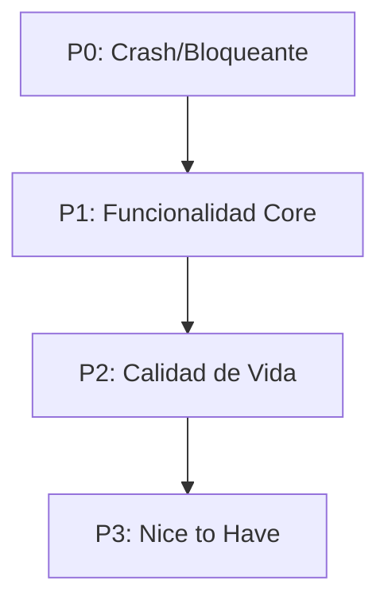
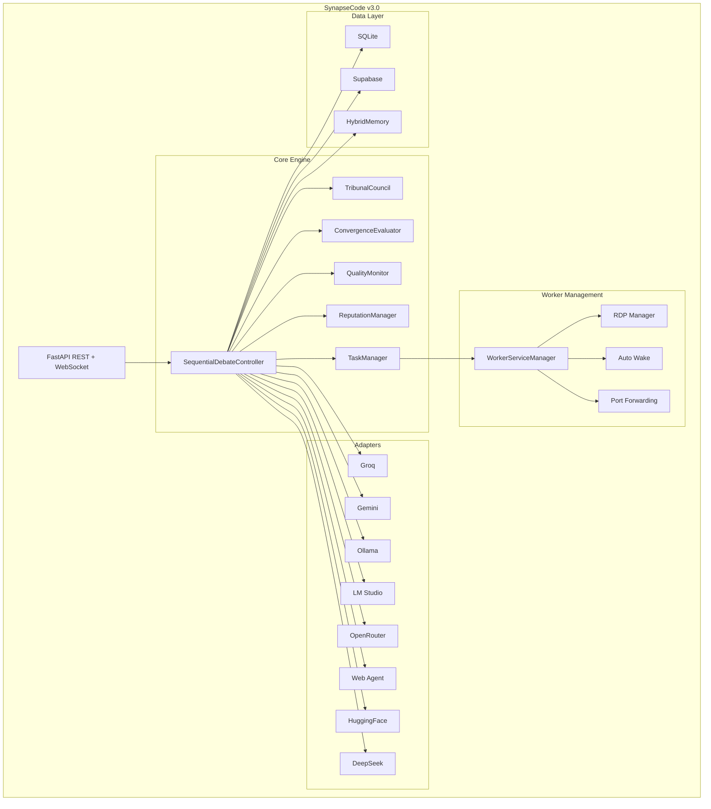

# 🗺️ Synapse Code v2.4+ — Plan de Mejoras y Optimizaciones

> Actualizado: 14 Mayo 2026, 22:29 UTC+02:00
> Estado actual: v2.3
> APIs funcionales: Groq, Gemini, Ollama, LM Studio, OpenRouter (base) | Pendientes: DeepSeek, HuggingFace

---

## Prioridades

---

## ✅ Completado Recientemente (14 Mayo 2026)

### ✅ Data Warehouse / Análisis Histórico
**Implementado:** Sistema de agregación de datos para analytics
- Tablas: DebateAggregate, TopicTrending, ConsensusPattern, ModelPerformance, DailyMetricsSnapshot
- Triggers automáticos en debate controllers para actualizar warehouse
- Script de backfill para datos históricos
- Queries SQL para análisis en `docs/ANALYTICS_QUERIES.md`

**Archivos:** `backend/database/models.py`, `backend/database/warehouse.py`, `backend/engine/sequential_debate_controller.py`, `backend/engine/session_manager.py`

### ✅ Caché Semántica
**Implementado:** Sistema de caché basado en embeddings y similitud coseno
- Modelo: sentence-transformers (all-MiniLM-L6-v2)
- Búsqueda semántica con threshold configurable (0.85)
- TTL configurable (24 horas por defecto)
- Integrado en todos los adapters (Groq, Gemini, OpenRouter, LM Studio, Jan)
- API endpoints: `/api/v1/cache/stats`, `/api/v1/cache/invalidate`, `/api/v1/cache/cleanup`
- Dashboard frontend en `frontend/src/components/Cache/CacheDashboard.jsx`

**Archivos:** `backend/database/models.py`, `backend/caching/semantic_cache.py`, `backend/adapters/groq.py`, `backend/adapters/gemini.py`, `backend/adapters/base.py`, `backend/api/routes/cache.py`, `frontend/src/components/Cache/CacheDashboard.jsx`

### ✅ Supabase Sync Fix
**Implementado:** Silent fail cuando Supabase no está configurado
- `SUPABASE_ENABLED=false` desactiva completamente el sync
- `get_supabase_service()` no crea instancia persistente si no está habilitado
- `submit_supabase_sync()` verifica estado antes de intentar sync
- No genera logs de error cuando no está configurado

**Archivos:** `backend/services/supabase_sync.py`, `backend/engine/task_manager.py`

---

## 🔴 P0 — Crítico / Bloqueante

### 0.1 — Timeout en debates con modelos grandes
**Problema:** Los modelos grandes (llama3:8b, deepseek-r1:7b) pueden tardar 2-5 minutos en generar, causando timeouts HTTP en el endpoint `/debates/create`.

**Solución:**
- Usar WebSocket + polling en lugar de HTTP long-poll
- Añadir timeout configurable por modelo en `config.py`
- WebSocket heartbeat del Worker para detectar generación congelada

**Archivos:** `sequential_debate_controller.py`, `websocket.py`, `config.py`

### ✅ 0.2 — Supabase sync sin API key válida
**Estado:** COMPLETADO (14 Mayo 2026)
**Solución implementada:**
- `SUPABASE_ENABLED=false` desactiva completamente el sync
- Silent fail rápido si no hay URL/config
- `get_supabase_service()` no crea instancia persistente si no está habilitado
- `submit_supabase_sync()` verifica estado antes de intentar sync

**Archivos:** `services/supabase_sync.py`, `engine/task_manager.py`

---

## 🟠 P1 — Funcionalidad Core

### 1.1 — HuggingFace Inference API Adapter
**Por qué:** Servicio gratuito con miles de modelos open-source (30k req/mes), sin necesidad de tarjeta de crédito.

**Qué hacer:**
- Crear `adapters/huggingface.py`
- Soportar modelos gratuitos: `microsoft/Phi-3-mini-4k-instruct`, `meta-llama/Meta-Llama-3-8B-Instruct`
- Endpoint: `https://api-inference.huggingface.co/models/{model}`

**Archivos nuevos:** `backend/adapters/huggingface.py`

### 1.2 — DeepSeek via API alternativa
**Problema:** La API key actual tiene saldo insuficiente (402).

**Soluciones:**
- Probar si `deepseek-chat` funciona con otro proveedor (OpenRouter)
- Añadir fallback automático: DeepSeek → OpenRouter → Groq

**Archivos:** `adapters/deepseek.py`, `engine/sequential_debate_controller.py`

### 1.3 — OpenRouter con crédito mínimo
**Problema:** OpenRouter requiere mínimo $1 para desbloquear modelos gratuitos.

**Solución:**
- Mostrar mensaje claro en health check cuando el key es válida pero sin crédito
- Añadir endpoint `POST /api/v1/system/openrouter/check-credits`

**Archivos:** `adapters/openrouter.py`, `api/routes/system.py`

### 1.4 — Pausar/Reanudar debates en ejecución
**Por qué:** Los debates largos (4+ modelos) pueden tardar >10 min. Si el servidor se cae, se pierde el progreso.

**Qué hacer:**
- Persistir el estado del debate en SQLite después de CADA turno (ya parcialmente implementado)
- Endpoint `POST /debates/{id}/pause` y `POST /debates/{id}/resume`
- Recuperar sesión desde DB al reiniciar servidor

**Archivos:** `sequential_debate_controller.py`, `api/routes/debate.py`

### 1.5 — Configuración de agentes personalizada desde API
**Por qué:** Actualmente los agentes están hardcodeados en `get_standard_debate_config()`.

**Qué hacer:**
- Permitir pasar `agents: [...]` en el body de `POST /debates/create`
- Validar que los engines existan y tengan API key configurada

**Archivos:** `api/routes/debate.py` (ya hay un `DebateRequest.agents` parcial)

---

## 🟡 P2 — Calidad de Vida

### 2.1 — Sistema de logs centralizado y rotatorio
**Problema:** Los logs se mezclan en stdout/stderr sin persistencia.

**Solución:**
- Logs rotatorios diarios en `logs/`
- Niveles configurables por módulo
- Logs HTTP separados de logs de engine

**Archivos:** `main.py`, `config.py`

### 2.2 — Health check inteligente por servicio
**Problema:** El health check actual solo dice "online/offline". No diagnostica problemas.

**Solución:**
- Para cada servicio offline, añadir:
  - `last_error`: Último error encontrado
  - `uptime`: Tiempo desde último reinicio
  - `suggested_fix`: Sugerencia de solución
- Para APIs con key inválida, mostrar link de registro

**Archivos:** `api/routes/health.py`, `adapters/*.py`

### 2.3 — Panel web de administración
**Por qué:** Actualmente solo hay frontend de chat. Un panel admin facilitaría:
- Ver estado del Worker en tiempo real
- Lanzar/detener servicios remotamente
- Ver logs en vivo
- Gestionar API keys

**Qué hacer:**
- App React simple con Dashboard
- Consumo de endpoints `/api/v1/system/*`
- Protegido con `ADMIN_API_TOKEN`

**Archivos nuevos:** `frontend/src/components/Admin/`

### 2.4 — Pruebas unitarias y de integración automatizadas
**Por qué:** El proyecto solo tiene tests manuales (curl).

**Qué hacer:**
- `tests/test_adapters_groq.py` — Test de Groq API con mock
- `tests/test_debate_pipeline.py` — Test del pipeline completo
- `tests/test_worker_launcher.py` — Test de detección de servicios
- CI con GitHub Actions (push y PR)

**Archivos nuevos:** `backend/tests/`, `.github/workflows/`

### 2.5 — Exportación de resultados
**Por qué:** Los reportes estructurados solo están en memoria o DB. No hay exportación.

**Qué hacer:**
- `GET /debates/{id}/export/pdf` — Exportar a PDF
- `GET /debates/{id}/export/json` — Exportar JSON raw
- `GET /debates/{id}/export/markdown` — Transcripción en MD

**Archivos:** `api/routes/debate.py`

---

## 🟢 P3 — Nice to Have

### 3.1 — Más proveedores cloud gratuitos
| Proveedor | Modelos | Límite | Cómo |
|-----------|---------|--------|------|
| **Together AI** | Llama 3, Mixtral, DeepSeek | $1 free | API key |
| **Cohere** | Command R, R+ | 100 calls/día trial | API key |
| **Perplexity** | Sonar, Sonar Pro | 50 req/día trial | API key |
| **Mistral AI** | Mistral Large, Small | Free tier limited | API key |

### 3.2 — Soporte para WebSocket en el Worker
**Problema:** El WebAgent usa HTTP polling. Podría ser más eficiente con WebSocket.

**Solución:** WebSocket bidireccional para streaming de tokens desde el Worker al Master.

### 3.3 — Modo oscuro automático en frontend
El frontend ya tiene tema oscuro pero solo manual. Añadir detección de preferencia del sistema.

### 3.4 — notificaciones desktop
Cuando un debate termina, notificar al usuario via:
- Windows Toast Notifications
- Sonido
- Ping en la web

### 3.5 — Estadísticas y gráficas
- Tiempo promedio de respuesta por modelo
- Tasa de éxito por API
- Costo estimado por debate
- Dashboard con Chart.js o similar

### 3.6 — Comandos de voz
Integrar Web Speech API para dictar prompts al debate.

---

## 📋 Resumen por Prioridad

| ID | Tarea | Prioridad | Esfuerzo | Estado | Dependencias |
|----|-------|-----------|----------|--------|-------------|
| 0.1 | Timeout en debates largos | 🔴 P0 | 2 días | Pendiente | — |
| 0.2 | Supabase silencioso sin key | 🔴 P0 | 1 hora | ✅ Completado | — |
| 1.1 | Adapter HuggingFace | 🟠 P1 | 3 horas | Pendiente | — |
| 1.2 | DeepSeek fallback | 🟠 P1 | 2 horas | Pendiente | — |
| 1.3 | OpenRouter check credits | 🟠 P1 | 1 hora | Pendiente | — |
| 1.4 | Pausar/Reanudar debates | 🟠 P1 | 1 día | Pendiente | DB persistence |
| 1.5 | Agentes personalizados API | 🟠 P1 | 4 horas | Pendiente | — |
| 2.1 | Logs rotatorios | 🟡 P2 | 2 horas | Pendiente | — |
| 2.2 | Health check inteligente | 🟡 P2 | 3 horas | Pendiente | — |
| 2.3 | Panel admin web | 🟡 P2 | 2 días | Pendiente | — |
| 2.4 | Tests automatizados | 🟡 P2 | 3 días | Pendiente | GitHub Actions |
| 2.5 | Exportación resultados | 🟡 P2 | 1 día | Pendiente | — |
| 3.1 | Más proveedores | 🟢 P3 | 4 horas cada uno | Pendiente | — |
| 3.2 | WebSocket Worker | 🟢 P3 | 1 día | Pendiente | — |
| 3.3 | Modo oscuro auto | 🟢 P3 | 30 min | Pendiente | — |
| 3.4 | Notificaciones | 🟢 P3 | 1 día | Pendiente | — |
| 3.5 | Estadísticas | 🟢 P3 | 2 días | Pendiente | — |
| 3.6 | Comandos de voz | 🟢 P3 | 1 día | Pendiente | — |

---

## 🎯 Próximos Pasos Prioritarios (Orden Sugerido)

1. **P0.1 - Timeout en debates con modelos grandes** (Crítico)
   - Implementar WebSocket + polling para debates largos
   - Timeout configurable por modelo en config.py
   - Heartbeat del Worker para detectar generación congelada

2. **P1.1 - HuggingFace Inference API Adapter** (Funcionalidad Core)
   - Servicio gratuito con 30k req/mes
   - Modelos: Phi-3-mini, Llama-3-8B-Instruct
   - Sin necesidad de tarjeta de crédito

3. **P1.4 - Pausar/Reanudar debates en ejecución** (Funcionalidad Core)
   - Persistir estado después de cada turno
   - Endpoints pause/resume
   - Recuperar sesión al reiniciar servidor

4. **P1.5 - Configuración de agentes personalizada desde API** (Funcionalidad Core)
   - Permitir pasar agents: [...] en POST /debates/create
   - Validar engines y API keys

---

---

## 🔧 Optimizaciones Técnicas

### Rendimiento
- [ ] **Caché de health check**: Ya existe (30s), pero podría ser configurable
- [ ] **Pool de conexiones HTTP**: `HTTPClientManager` ya lo implementa, verificar que todos los adapters lo usen
- [ ] **Lazy loading de módulos**: Ya implementado para OpenRouter, aplicarlo a Groq y Gemini
- [ ] **Compresión de respuestas HTTP**: Añadir `gzip` middleware
- [ ] **Indexación de DB**: Verificar índices en tablas `sequential_debates` y `sequential_debate_turns`

### Seguridad
- [ ] **Validación de API keys** antes de usarlas (health check con auth test)
- [ ] **Rate limiting por endpoint** (no global)
- [ ] **Audit log** de acciones administrativas
- [ ] **CORS configurable por origen** (ya implementado en v2.2)
- [ ] **Rotación de API keys** vía web

### Mantenibilidad
- [ ] **Refactorizar `sequential_debate_controller.py`**: 1734 líneas — dividir en módulos más pequeños
- [ ] **Documentar con docstrings** todos los métodos públicos
- [ ] **Tipado estático** con MyPy (ya en requirements)
- [ ] **Pre-commit hooks** (ruff, mypy, black)

---

## 📐 Arquitectura Propuesta

---

> **Última actualización:** 14 Mayo 2026, 22:29 UTC+02:00
> **Versión actual:** v2.3
> **Próximo hito:** v2.4 — Timeout en debates + HuggingFace Adapter + Pausar/Reanudar debates
> **Estimado:** 1-2 semanas de desarrollo
